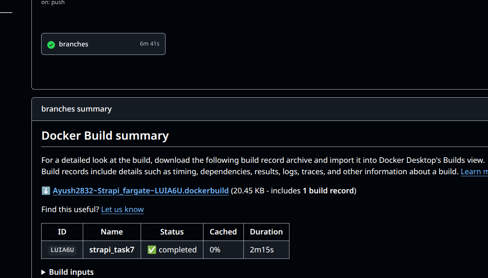
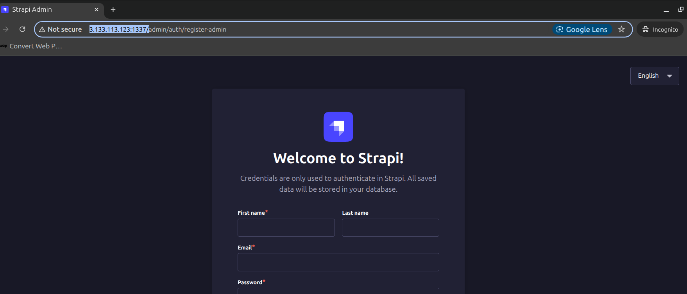
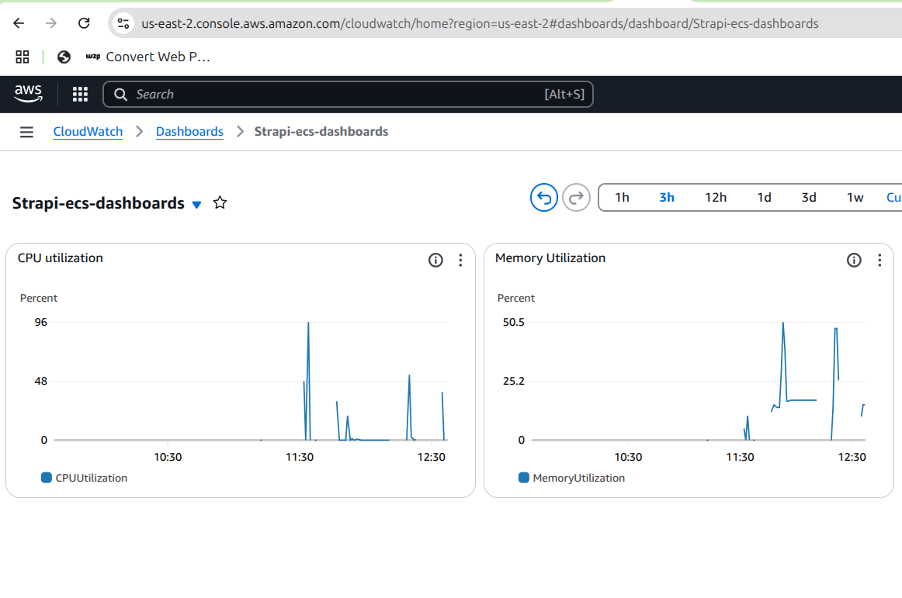
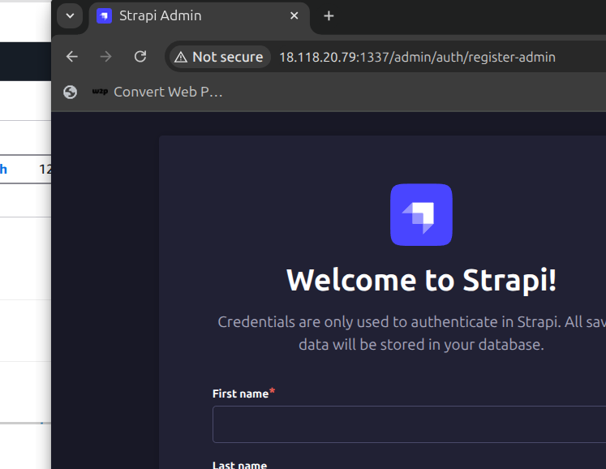

# Task 7 and Task 8 and Task 9
## Task 7: Deploy a Strapi application on AWS using ECS Fargate, managed entirely via Terraform and Automate via GitHub Actions [ci/cd]

## 1. Basic setup
- First we have to setup our strapi app using
> npx create-strapi@latest
- Then we can create image of that app using the dockerfile. But it need env file during image creation. So instead of passing env file in the github repository, we will add the env file arguments in the secrets and then we will fetch them in the cicd pipeline.
```dockerfile
FROM node
ARG ENCRYPTION_KEY
ARG DATABASE_CLIENT=sqlite
ARG DATABASE_FILENAME=.tmp/data.db

# set env
ENV DATABASE_CLIENT=${DATABASE_CLIENT}
ENV DATABASE_FILENAME=${DATABASE_FILENAME}
ENV HOST=${HOST}
ENV PORT=${PORT}
ENV APP_KEYS=${APP_KEYS}
ENV API_TOKEN_SALT=${API_TOKEN_SALT}
ENV ADMIN_JWT_SECRET=${ADMIN_JWT_SECRET}
ENV TRANSFER_TOKEN_SALT=${TRANSFER_TOKEN_SALT}
ENV JWT_SECRET=${JWT_SECRET}
ENV ENCRYPTION_KEY=${ENCRYPTION_KEY}

WORKDIR /opt/
COPY . .
RUN npm install -g node-gyp && npm config set fetch-retry-maxtimeout 600000 -g && npm install
ENV PATH=./node_modules/.bin:$PATH
RUN ["npm", "run", "build"]
EXPOSE 1337
CMD ["npm", "run", "develop"]

WORKDIR /opt/
COPY . .
RUN npm install -g node-gyp && npm config set fetch-retry-maxtimeout 600000 -g && npm install
ENV PATH=./node_modules/.bin:$PATH
RUN ["npm", "run", "build"]
EXPOSE 1337
CMD ["npm", "run", "develop"]
```
- Then we can run the commands to check if it is working fine or not.
> docker build -t imagename .

> docker run -d --name contname -p 1337:1337 --env-file .env imagemid

## 2. Terraform files
- In the terraform directory we have define the terraform files for different infrastructure.

- For VPC network setup we have the file [vpc.tf](./terraform/vpc.tf)

- Then for ecs creation we have the file [ecs.tf](./terraform/ecs.tf)

## 3. Github action files
- Once all these things are configure we will then make `deploy.yml` file which will just checkout the code and then it make the docker image of it and then push the image to the docker hub.
- Then at last it will run terraform init and terraform apply.

- Here it will checkout the code and try ot login with the docker
```yml
    steps:
    - name: Checkout code
      uses: actions/checkout@v4

    - name: Log in to DockerHub
      uses: docker/login-action@v3
      with:
        username: ${{ secrets.DOCKER_USERNAME }}
        password: ${{ secrets.DOCKER_PASSWORD }}
```

- And then it will push the image to the docker registry. Also we have to pass the env file secrets.

```yml
    - name: Build image
      run: |
        docker build \
        --build-arg HOST=0.0.0.0 \
        --build-arg PORT=1337 \
        --build-arg APP_KEYS=${{secrets.APP_KEYS}} \
        --build-arg API_TOKEN_SALT=${{secrets.API_TOKEN_SALT}} \
        --build-arg ADMIN_JWT_SECRET=${{secrets.ADMIN_JWT_SECRET}} \
        --build-arg TRANSFER_TOKEN_SALT=${{secrets.TRANSFER_TOKEN_SALT}} \
        --build-arg JWT_SECRET=${{secrets.JWT_SECRET}} \
        --build-arg ENCRYPTION_KEY=${{secrets.ENCRYPTION_KEY}} \
        -t ${{env.IMAGE_NAME}}:${{env.IMAGE_TAG}} ./strapi_task7/

    - name: Push the image
      run: |
        docker push ${{env.IMAGE_NAME}}:${{env.IMAGE_TAG}}
```

- And then we run the same terraform terraform init and apply command

```yml
    - name: terraform setup
      uses: hashicorp/setup-terraform@v3

    - name: Terraform init
      run: terraform init
      working-directory: ./terraform

    - name: Terraform Apply
      run: terraform apply -auto-approve -var="image_tag=${{ env.IMAGE_TAG }}"
      working-directory: ./terraform
      env:
        AWS_ACCESS_KEY_ID: ${{ secrets.AWS_ACCESS_KEY_ID }}
        AWS_SECRET_ACCESS_KEY: ${{ secrets.AWS_SECRET_ACCESS_KEY }}
```

- For artifact I am following this blog. What I am doing is downloading the terraform state file as artifact and then delete the infra structure manually.
> [link](https://docs.github.com/en/actions/writing-workflows/choosing-what-your-workflow-does/storing-and-sharing-data-from-a-workflow)

```yml
      - name: Archive code coverage results
        uses: actions/upload-artifact@v4
        with:
          name: terraform statefile
          path: ./terraform/terraform.tfstate
```

### 4. Result
- Once we run the command
> git push origin master
- And it will trigger the pipeline.



- And then we copy the ip from the ecs task and then paste in the browser.



## Task 8 : Add CloudWatch for Monitoring (Logging & Metrics)
- So first we create the IAM role for the ECS so that it can send logs to the cloudwatch

```vim
resource "aws_iam_role" "ecs_task_execution_role" {
  name = "ecsTaskExecutionRole"

  assume_role_policy = jsonencode({
    Version = "2012-10-17",
    Statement = [
      {
        Action = "sts:AssumeRole",
        Effect = "Allow",
        Principal = {
          Service = "ecs-tasks.amazonaws.com"
        }
      }
    ]
  })
}

resource "aws_iam_role_policy_attachment" "ecs_execution_policy" {
  role       = aws_iam_role.ecs_task_execution_role.name
  policy_arn = "arn:aws:iam::aws:policy/service-role/AmazonECSTaskExecutionRolePolicy"
}
```
- Then we associate it with the service.

```vim
resource "aws_ecs_task_definition" "strapi" {
  family                   = "strapi-task"
  requires_compatibilities = ["FARGATE"]
  network_mode             = "awsvpc"
  cpu                      = "1024"
  memory                   = "3072"
  execution_role_arn       = aws_iam_role.ecs_task_execution_role.arn <<--
```
- Then we update the log configuration for the ecs task definition
```vim
      logConfiguration = {
        logDriver = "awslogs"
        options = {
          awslogs-group = "/ecs/strapi"
          awslogs-region = var.aws_region
          awslogs-stream-prefix = "ecs"
        }
      }
```

- Finally we will create log group and then for dashboard we can define like this
```vim
resource "aws_cloudwatch_log_group" "strapi_logs" {
  name              = "/ecs/strapi"
  retention_in_days = 7

  tags = {
    Name = "Strapi-loggroup"
  }
}

resource "aws_cloudwatch_dashboard" "dashboards" {
  dashboard_name = "Strapi-ecs-dashboards"
  dashboard_body = jsonencode({
    widgets = [
      {
        type = "metric",
        x = 0,
        y = 0,
        width = 10,
        height = 7,

        properties = {
          title = "CPU utilization"
          metrics = [
            [
              "AWS/ECS",
              "CPUUtilization",
              "ClusterName",
              var.strapi_cluster,
              "ServiceName",
              var.strapi_service
            ]
          ]
          period = 30, # we are getting data in each 30 sec
          stat = "Average",
          region = var.aws_region

        },
        
      },
      {
        type = "metric"
        x = 0,
        y = 0,
        width = 10,
        height = 7,

        properties = {
          title = "Memory Utilization",
          metrics = [
            [
              "AWS/ECS",
              "MemoryUtilization",
              "ClusterName",
              var.strapi_cluster,
              "ServiceName",
              var.strapi_service
            ]
          ]
          period = 30,
          stat = "Average",
          region = var.aws_region
        }
      },
    ]
  })
  
}
```
- Finally we trigger the pipline by pushing the code on github
> git push origin master

### Result
- Then we navigate to the aws dashboard and we can see that the dashboard is created.


- And also our application is working fine


## Task 9: Running on Fragate Spote instead of Fragate
- For this we have to make few changes in the ecs.tf


- I service definition we have to comment the launch type and mention the task definition there
```vim
  # launch_type   = "FARGATE"

  # And this block also if we dont want to use Fragate Spot
  capacity_provider_strategy {
    capacity_provider = "FARGATE_SPOT"
    weight = 1
  }
```
- And then run our pipline with
> git push origin master

- The resource which I followed are these > [link1](https://medium.com/@belka.zver/fargate-spot-quick-overview-and-set-up-using-terraform-a4974b1ae8f) [link2](https://medium.com/@maheshgaikwad128/understanding-ecs-fargate-and-fargate-spot-scaling-and-cost-optimization-with-terraform-1f9346aa2f8f)

- Once all things done you can go console and see if the container is running or not.